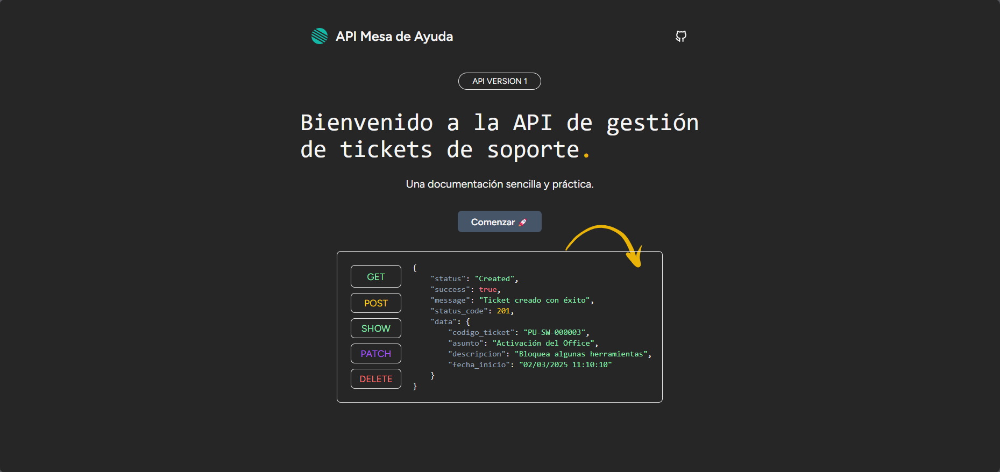
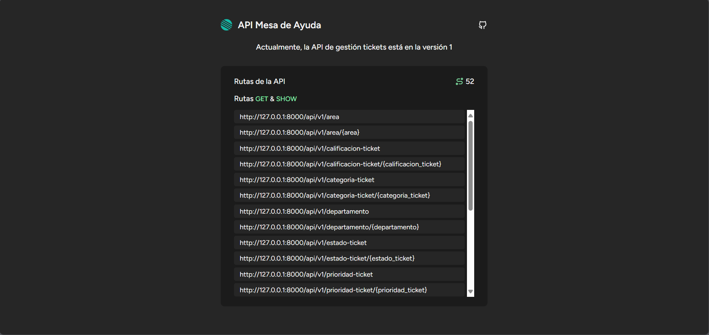

<div align="center">
    
    <h1>API Mesa de Ayuda</h1>
</div>


## Descripción

La API Mesa de Ayuda permite a los usuarios crear tickets de soporte técnico, clasificándolos en "Hardware" o "Software", los tickets pueden pasar por diferentes estados como "Nuevo", "En proceso", "En espera" o "Completado", facilitando el seguimiento. Además, el sistema organiza las solicitudes según su urgencia "Alta", "Media" o "Baja", optimizando la gestión y resolución de problemas por parte del equipo de soporte. Además de calificar el ticket una vez este finalizado por el técnico.

<div style="display: flex; flex-direction: column; align-items: center; gap: 10px;">
    
    
</div>

## 🚀 Comandos de Desarrollo

A continuación, se presentan los comandos disponibles en el archivo `./package.json` para el desarrollo del proyecto.

### 📌 Ejecutar el servidor de desarrollo

Ejecuta Vite, el servidor de desarrollo para compilar y actualizar los archivos automáticamente.
Se usa para ver los cambios en tiempo real mientras trabajas en el proyecto, en `./resources/views/...`

```sh
npm run dev
```

### 🎨 Compilar estilos con Tailwind CSS

Ejecuta Tailwind CSS, compilando los estilos desde `./resources/css/app.css` y generando `./public/tailwind.css`.
La opción `--watch` mantiene el proceso en ejecución y recompila cuando hay cambios. 
Se debe de ejecutar cuando se haya detenido `npm run dev` para hacer una sola compilación ya que este comando
no te muestra los cambios en tiempo real, salvo a que se refresque el navegador.


```sh
npm run tailwind
```

##### NOTA: Actualmente, la API se encuentra en desarrollo 🎉
